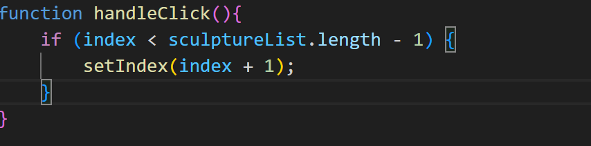
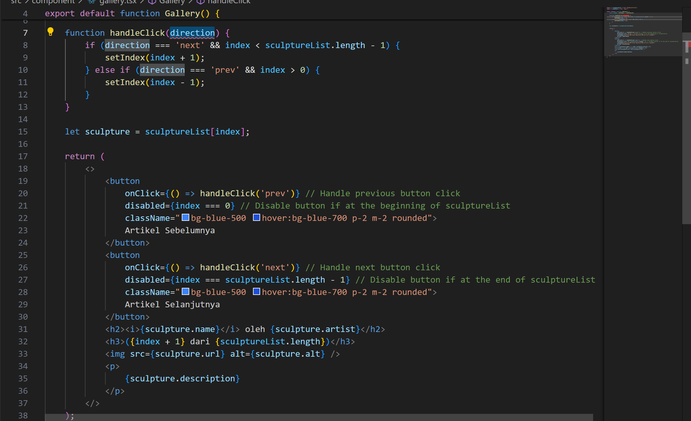

This is a [Next.js](https://nextjs.org/) project bootstrapped with [`create-next-app`](https://github.com/vercel/next.js/tree/canary/packages/create-next-app).

## Getting Started

First, run the development server:

```bash
npm run dev
# or
yarn dev
# or
pnpm dev
# or
bun dev
```

Open [http://localhost:3000](http://localhost:3000) with your browser to see the result.

You can start editing the page by modifying `app/page.tsx`. The page auto-updates as you edit the file.

This project uses [`next/font`](https://nextjs.org/docs/basic-features/font-optimization) to automatically optimize and load Inter, a custom Google Font.

## Laporan Praktikum

|  | Pemrograman Berbasis Framework 2024 |
|--|--|
| NIM |  2141720152|
| Nama |  Khafillah Akbar Syahputra |
| Kelas | TI - 3I |


### Jawaban Soal 1

Jika kita menekan tombol "Artikel Selanjutnya" sebanyak 5x (atau melebihi halaman total artikel), apa yang akan terjadi?

- Website akan error karena tidak ada data selanjutnya untuk website untuk dibaca

### Jawaban Soal 2

Modifikasilah gallery.tsx agar bisa meng-handle permasalahan tersebut.


- Pada fungsi handle click akan ada pembatasan 


### Jawaban Soal 3

Tambahkan tombol "Artikel Sebelumnya", untuk menampilkan artikel secara mundur.



### Jawaban Soal 4

Apa perbedaan dari fungsi Form_2 yang pertama dengan yang kedua?

- Jawabannya hampir sama, namun kedua membuat syntax lebih sedikit dan ringkas

### Jawaban Soal 5

Kenapa perlu menghapus state fullName? Apa keuntungannya?
- Membuat syintax lebih sedikit dan lebih mudah dipahami


Contoh perubahan.